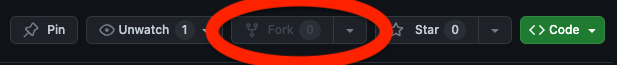
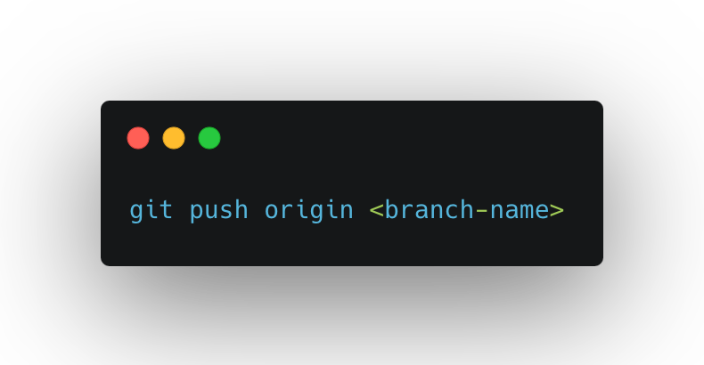

# guestbook
Make your first open source contribution with this public repository

## How to contribute
1. Fork this repository
    - <br />
2. Clone the repository to your local machine
    -  ```2a. copy the url from the forked repository```
        -  
    -   ```2b. open your terminal```
    -   ```2c. cd to the directory you want to clone the repository to```
    -    ```2d. git clone <url>```
    - 
3. Create a new branch
    - ```3a. git checkout -b <branch-name>```
        - 
4. Add your name to the guestbook.md file
    - ```4a. open the guestbook.md file```
    - ```4b. add your name to the list``` 
        - 
5. Commit your changes
    - ```5a. git add .```
    - ```5b. git commit -m "added <your-name> to the guestbook"```
        - 
6. Push to the branch
    - ```6a. git push origin <branch-name>```
        - 
7. Create a new pull request
    - ```7a. go to the forked repository```
    - ```7b. click on the pull request button```
        - 
    - ```7c. select the branch you want to merge into the master branch```
    - ```7d. add a title and description to your pull request```
    - ```7e. click on the create pull request button```
        - 

[Checkout the guestbook](./guestbook.md)

If you have any questions, 
connect with me on [linkedin](https://www.linkedin.com/in/richkevan/)
feel free to reach out to me on [twitter](https://twitter.com/richkevan)
shoot me an [email](mailto:hey@richkevan.com)
join the main channel on [discord](https://discord.gg/7Kuu52UeyN)
